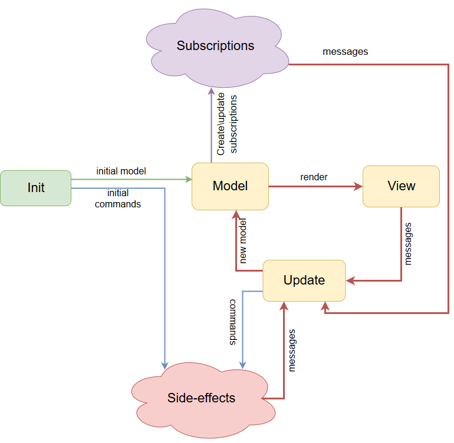

# dartea
[](https://travis-ci.org/p69/dartea)  [](https://codecov.io/gh/p69/dartea)

Implementation of MVU (Model View Update) pattern for Flutter.
Inspired by [TEA (The Elm Architecture)](https://guide.elm-lang.org/architecture/) and [Elmish (F# TEA implemetation)](https://fable-elmish.github.io/elmish/)



## Key concepts
This app architecture is based on three key things:
1. Model (App state) must be immutable.
2. View and Update fucntions must be pure.
3. All side-effects should be separated from the UI logic.

The heart of the dartea application are three yellow boxes on the diagram above. First, the state of the app (Model) is mapped to the widgets tree (View). Second, events from the UI are translated into Messages and go to the Update function (together with current app state). Update function is the brain of the app. It contains all the presentation logic, and it MUST be [pure](https://en.wikipedia.org/wiki/Pure_function). All the side-effects (such as database queries, http requests and etc) must be isolated using Commands and Subscriptions.

## Simple counter example

### Model and Message:
```dart
class Model {
  final int counter;
  Model(this.counter);
}

abstract class Message {}
class Increment implements Message {}
class Decrement implements Message {}
```

### View:
```dart
Widget view(BuildContext context, Dispatch<Message> dispatch, Model model) {
  return Scaffold(
    appBar: AppBar(
      title: Text('Simple dartea counter'),
    ),
    body: Center(
      child: Column(
        mainAxisAlignment: MainAxisAlignment.center,
        crossAxisAlignment: CrossAxisAlignment.center,
        children: <Widget>[
          Text(
            '${model.counter}',
            style: Theme.of(context).textTheme.display1,
          ),
          Padding(
            child: RaisedButton.icon(
              label: Text('Increment'),
              icon: Icon(Icons.add),
              onPressed:() => dispatch(Increment()),
            ),
            padding: EdgeInsets.all(5.0),
          ),
          RaisedButton.icon(
            label: Text('Decrement'),
            icon: Icon(Icons.remove),
            onPressed:  () => dispatch(Decrement()),
          ),
        ],
      ),
    ),
  );
}
```

### Update:
```dart
Upd<Model, Message> update(Message msg, Model model) {
  if (msg is Increment) {
    return Upd(Model(model.counter + 1));
  }
  if (msg is Decrement) {
    return Upd(Model(model.counter - 1));
  }
  return Upd(model);
}
```

### Bootstrap program and run Flutter app
```dart
void main() {
  final program = Program(
      () => Model(0), //create initial state
      update,
      view);
  runApp(MyApp(program));
}

class MyApp extends StatelessWidget {
  final Program darteaProgram;

  MyApp(this.darteaProgram);

  @override
  Widget build(BuildContext context) {
    return MaterialApp(
      title: 'Dartea counter example',
      theme: ThemeData(
        primarySwatch: Colors.blue,
      ),
      home: darteaProgram.build(key: Key('root_key')),
    );
  }
}
```

And that's it. [Here](/example) is more advanced example.

## Pros
1. Single responsibility. Whole application state is in `model`, all the logic is in `update`,
all the UI is in `view`.
2. `view` and `update` are pure functions and `model` is immutable - easy to test, easy to maintain.
3. Easy and straitforward composition. You can split your app into nested components (`model`, `view`, `update`).
4. Side-effects are decoupled and isolated. It helps us to write and refactor presentation logic and side-effects separately.
5. `model` and `messagess` describe all possible application's states.

## Cons
1. `setState()` is called on the root widget and it means that every widget in the tree should be rebuilt. Flutter is smart enough to make just incremental changes, but in general this is not so good.
2. `update` function is pure and easy for testing, but testing side-effects (`commands`) can be tricky. Although I think in most cases we can avoid it, it could be necessary sometimes. You can find examples of commands testing [here](https://github.com/brianegan/flutter_architecture_samples/blob/master/example/mvu/test/stats_screen_test.dart). It's a pretty good example of a Todo app.
3. Even though composition is easy and straightforward, it requires some boilerplate code.

## Sample apps
* [Calculator](https://github.com/p69/dartea_calculator)
* [Todo](https://github.com/brianegan/flutter_architecture_samples/tree/master/example/mvu)