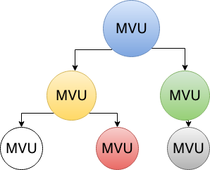

# Dartea
[](https://travis-ci.org/p69/dartea)  [](https://codecov.io/gh/p69/dartea)

Implementation of MVU (Model View Update) pattern for Flutter.
Inspired by [TEA (The Elm Architecture)](https://guide.elm-lang.org/architecture/) and [Elmish (F# TEA implemetation)](https://github.com/elmish/elmish)


## Key concepts
This app architecture is based on three key things:
1. Model (App state) must be immutable.
2. View and Update functions must be pure.
3. All side-effects should be separated from the UI logic.

The heart of the `Dartea` application are three yellow boxes on the diagram above. First, the state of the app (Model) is mapped to the widgets tree (View). Second, events from the UI are translated into Messages and go to the Update function (together with current app state). Update function is the brain of the app. It contains all the presentation logic, and it MUST be [pure](https://en.wikipedia.org/wiki/Pure_function). All the side-effects (such as database queries, http requests and etc) must be isolated using `Commands` and `Subscriptions`.

## Simple counter example

### Model and Message:
```dart
class Model {
  final int counter;
  Model(this.counter);
}

abstract class Message {}
class Increment implements Message {}
class Decrement implements Message {}
```

### View:
```dart
Widget view(BuildContext context, Dispatch<Message> dispatch, Model model) {
  return Scaffold(
    appBar: AppBar(
      title: Text('Simple dartea counter'),
    ),
    body: Center(
      child: Column(
        mainAxisAlignment: MainAxisAlignment.center,
        crossAxisAlignment: CrossAxisAlignment.center,
        children: <Widget>[
          Text(
            '${model.counter}',
            style: Theme.of(context).textTheme.display1,
          ),
          Padding(
            child: RaisedButton.icon(
              label: Text('Increment'),
              icon: Icon(Icons.add),
              onPressed:() => dispatch(Increment()),
            ),
            padding: EdgeInsets.all(5.0),
          ),
          RaisedButton.icon(
            label: Text('Decrement'),
            icon: Icon(Icons.remove),
            onPressed:  () => dispatch(Decrement()),
          ),
        ],
      ),
    ),
  );
}
```

### Update:
```dart
Upd<Model, Message> update(Message msg, Model model) {
  if (msg is Increment) {
    return Upd(Model(model.counter + 1));
  }
  if (msg is Decrement) {
    return Upd(Model(model.counter - 1));
  }
  return Upd(model);
}
```

### Update with side-effects:
```dart
Upd<Model, Message> update(Message msg, Model model) {  
  final persistCounterCmd = Cmd.ofAsyncAction(()=>Storage.save(model.counter));
  if (msg is Increment) {    
    return Upd(Model(model.counter + 1), effects: persistCounterCmd);
  }
  if (msg is Decrement) {
    return Upd(Model(model.counter - 1), effects: persistCounterCmd);
  }
  return Upd(model);
}
```

### Create program and run Flutter app
```dart
void main() {
  final program = Program(
      () => Model(0), //create initial state
      update,
      view);
  runApp(MyApp(program));
}

class MyApp extends StatelessWidget {
  final Program darteaProgram;

  MyApp(this.darteaProgram);

  @override
  Widget build(BuildContext context) {
    return MaterialApp(
      title: 'Dartea counter example',
      theme: ThemeData(
        primarySwatch: Colors.blue,
      ),
      home: darteaProgram.build(key: Key('root_key')),
    );
  }
}
```

And that's it.

### External world and subscriptions
`Dartea` program is closed loop with unidirectional data-flow. Which means it's closed for all the external sources (like sockets, database and etc). To connect `Dartea` program to some external events source one should use `Subscriptions`. `Subscription` is just a function (like `view` and `update`) with signature:
```dart
TSubHolder Function(TSubHolder currentSub, Dispatch<TMsg> dispatch, TModel model);
```
This function is called from `Dartea` engine right after every `model's` update. Here is an example of `Timer` subscription from the counter example.
```dart
const _timeout = const Duration(seconds: 1);
Timer _periodicTimerSubscription(
    Timer currentTimer, Dispatch<Message> dispatch, Model model) {
  if (model == null) {
    currentTimer?.cancel();
    return null;
  }
  if (model.autoIncrement) {
    if (currentTimer == null) {
      return Timer.periodic(_timeout, (_) => dispatch(Increment()));
    }
    return currentTimer;
  }
  currentTimer?.cancel();
  return null;
}
```
There is a flag `autoIncrement` in `model` for controlling state of a `subscription`. `currentTimer` parameter is a subscription holder, an object which controls `subscription` lifetime. It's generic parameter, so it could be anything (for example `StreamSubscription` in case of dart's built-in `Streams`). If this parameter is `null` then it means that there is no active subscription at this moment. Then we could create new `Timer` subscription (if `model's` state is satisfied some condition) and return it as a result. Returned `currentTimer` subscription will be stored inside `Dartea` engine and passed as a parameter to this function on the next `model's` update. If we want to cancel current subscription then just call `cancel()` (or `dispose()`, or whatever it uses for releasing resources) and return `null`. Also there is `dispatch` parameter, which is used for sending `messages` into the `Dartea` progam loop (just like in `view` function).
When `Dartea` program is removed from the widgets tree and getting disposed it calls `subscription` function last time to prevent memory leak. One should cancel the subscription if it happened.

Full counter example is [here](/examples/counter/)

## Scaling and composition
First of all we need to say that `MVU` or `TEA` is fractal architecture. It means that we can split entire app into small MVU-components and populate some tree from them.

### Traditional Elm composition



You can see how our application tree could look like. The relations are explicit and very strict.
We can describe it in code something like this:
```dart

class BlueModel {
  final Object stateField;
  final YellowModel yellow;
  final GreenModel green;
  //constructor, copyWith...
}

abstract class BlueMsg {}
class UpdateFieldBlueMsg implements BlueMsg {
  final Object newField;
}
class YellowModelBlueMsg implements BlueMsg {
  final YellowMsg innerMsg;
}
class GreenModelBlueMsg implements BlueMsg {
  final GreenMsg innerMsg;
}

Upd<BlueModel, BlueMsg> updateBlue(BlueMsg msg, BlueModel model) {
  if (msg is UpdateFieldBlueMsg) {
    return Upd(model.copyWith(stateField: msg.newField));
  }
  if (msg is YellowModelBlueMsg) {
    //update yellow sub-model
    final yellowUpd = yellowUpdate(msg.innerMsg, model.yellow);
    return Upd(model.copyWith(yellow: yellowUpd.model));
  }
  //the same for green model
}

Widget viewBlue(BuildContext ctx, Disptach<BlueMsg> dispatch, BlueModel model) {
  return Column(
    children: [
      viewField(model.stateField),
      //yellow sub-view
      viewYellow((m)=>dispatch(YellowModelBlueMsg(innerMsg: m)), model.yellow),
      //green sub-view
      viewGreen((m)=>dispatch(GreenModelBlueMsg(innerMsg: m)), model.green),
    ],
  );
}

//The same for all other components
```
As we can see everything is straightforward. Each `model` holds strong references to its `sub-models` and responsible for updating and displaying them. It's typical composition of an `elm` application and it works fine. The main drawback is bunch of boilerplate: fields for all `sub-models`, messages wrappers for all `sub-models`, huge `update` function. Also performance could be an issue in case of huge widgets tree with list view and frequent model updates. 
I recommend this approach for all screens where components logically strictly connected and no frequent updates of leaves components (white, red and grey on the picture).

### Alternative composition
In continue with Flutter's slogan `"Everything is a widget!"` we could imagine that each MVU-component of our app is a widget. And, fortunately, that is true. `Program` is like container for core functions (`init`, `update`, `view`, `subscribe` and etc) and when `build()` is called new widget is created and could be mounted somewhere in the widgets tree. Moreover `Dartea` has built-in `ProgramWidget` for more convinient way putting MVU-component into the widgets tree.
```dart
void main() => runApp(MyApp());

class MyApp extends StatelessWidget {
  @override
  Widget build(BuildContext context) {
    return DarteaMessagesBus(
      child: MaterialApp(        
        home: HomeWidget(),
      ),
    );
  }
}
class HomeWidget extends StatelessWidget {
  @override
  Widget build(BuildContext context) {
    return ProgramWidget(
      key: DarteaStorageKey('home'),
      init: _init,
      update: _update,
      view: _view,
      withDebugTrace: true,
      withMessagesBus: true,
    );
  }
}
```
First, we added special root widget `DarteaMessagesBus`. It's used as common messages bus for whole our app and should be only one per application, usually as root widget. It means that one MVU-component (or `ProgramWidget`) can send to another a message without explicit connections. To enable ability receiving messages from another components we need to set flag `withMessagesBus` to `true`, it makes our component open to outside world. There are two ways to send a message from one component to another.
```dart
//from update function
Upd<Model, Msg> update(Msg msg, Model model) {
  return Upd(model, msgsToBus: [AnotherModelMsg1(), AnotherModelMsg2()]);
}
//from view function
Widget view(BuildContext ctx, Dispatch<Msg> dispatch, Model model) {
  return RaisedButton(
    //...
    onPressed:(){
      final busDispatch = DarteaMessagesBus.dispatchOf(ctx);
      busDispatch?(AnotherModelMsg3());
    },
    //..
  );
}
```
And if there are any components which set `withMessagesBus` to `true` and can handle `AnotherModelMsg1`, `AnotherModelMsg2` or `AnotherModelMsg3`, then they receive all those messages.

Second, we added special key `DarteaStorageKey('home')` for `ProgramWidget`. That means that after every `update` `model` is saved in `PageStorage` using that key. And when `ProgramWidget` with the same key is removed from the tree and then added again it restores latest `model` from the `PageStorage` instead of calling `init` again. It could be helpfull in many cases, for example when there is `BottomNavigationBar`.
```dart
Widget _view(BuildContext ctx, Dispatch<HomeMsg> dispatch, HomeModel model) {
  return Scaffold(
    //...
    body: model.selectedTab == Tab.trending
        ? ProgramWidget(
            key: DarteaStorageKey('trending_tab_program'),
            //init, update, view
          )
    )
        : ProgramWidget(
            key: DarteaStorageKey('search_tab_program'),
            //init, update, view
          )
    ),
    bottomNavigationBar: _bottomNavigation(ctx, dispatch, model.selectedTab),
    //...
  );
}
```
Here we create new `ProgramWidget` when tab is switched, but `model` for each tab is saved and restored automatically and we do not lose UI state.
See full example of this approach in [GitHub client example](/examples/github_client/)
Using common messages bus and auto-save\restore mechanism helps us to compose loosely coupled components `ProgramWidget`. Communication protocol is described via `messages`. It reduces boilerplate code, removes strong connections. But at the same time it creates implicit connections between components. I suggest to use this approach when components are not connected logically, for example filter-component and content-component, tabs. 

## Sample apps
* [Calculator](https://github.com/p69/dartea_calculator)
* [Todo](https://github.com/brianegan/flutter_architecture_samples/tree/master/example/mvu)
* [GitHub client](examples/github_client/)